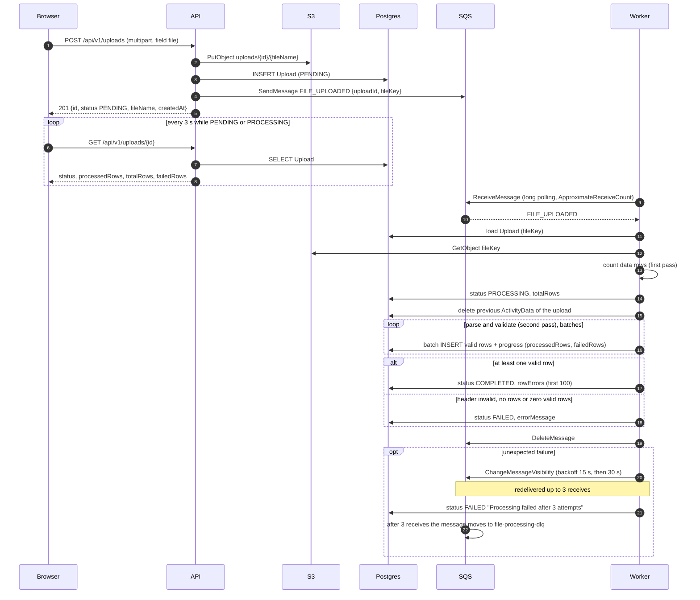

# Upload and processing flow

Sequence of one CSV upload, from the browser to the final status, including the retry and
dead-letter branch. The same diagram is embedded in the README.

```mermaid
sequenceDiagram
    autonumber
    participant B as Browser
    participant A as API
    participant S as S3
    participant P as Postgres
    participant Q as SQS
    participant W as Worker

    B->>A: POST /api/v1/uploads (multipart, field file)
    A->>S: PutObject uploads/{id}/{fileName}
    A->>P: INSERT Upload (PENDING)
    A->>Q: SendMessage FILE_UPLOADED {uploadId, fileKey}
    A-->>B: 201 {id, status PENDING, fileName, createdAt}

    loop every 3 s while PENDING or PROCESSING
        B->>A: GET /api/v1/uploads/{id}
        A->>P: SELECT Upload
        A-->>B: status, processedRows, totalRows, failedRows
    end

    W->>Q: ReceiveMessage (long polling, ApproximateReceiveCount)
    Q-->>W: FILE_UPLOADED
    W->>P: load Upload (fileKey)
    W->>S: GetObject fileKey
    W->>W: count data rows (first pass)
    W->>P: status PROCESSING, totalRows
    W->>P: delete previous ActivityData of the upload
    loop parse and validate (second pass), batches
        W->>P: batch INSERT valid rows + progress (processedRows, failedRows)
    end
    alt at least one valid row
        W->>P: status COMPLETED, rowErrors (first 100)
    else header invalid, no rows or zero valid rows
        W->>P: status FAILED, errorMessage
    end
    W->>Q: DeleteMessage

    opt unexpected failure
        W->>Q: ChangeMessageVisibility (backoff 15 s, then 30 s)
        Note over Q,W: redelivered up to 3 receives
        W->>P: status FAILED "Processing failed after 3 attempts"
        Q->>Q: after 3 receives the message moves to file-processing-dlq
    end
```
